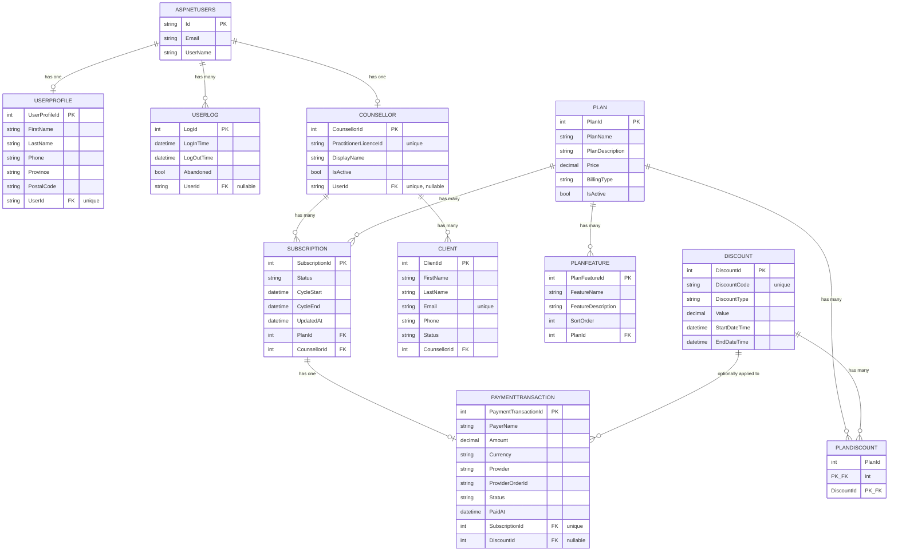

# Database Design

**Database Engine:** SQLite
**ORM:** Entity Framework Core 8.0.22
**DbContext:** `ApplicationDbContext` extends `IdentityDbContext`

---
## ER Diagram



---


## Entity: Plan

```csharp
public class Plan
{
    public int PlanId { get; set; }
    [Required, MaxLength(80)] public string PlanName { get; set; }
    [Required, MaxLength(500)] public string PlanDescription { get; set; }
    [Required, Range(0, 10000)] public decimal Price { get; set; }
    [Required] public string BillingType { get; set; }
    public bool IsActive { get; set; } = true;
    public DateTime CreatedAt { get; set; }
    public virtual ICollection<PlanFeature> PlanFeatures { get; set; }
    public virtual ICollection<Subscription> Subscriptions { get; set; }
    public virtual ICollection<PlanDiscount> PlanDiscounts { get; set; }
}
```

**Properties:** PlanId (PK), PlanName, PlanDescription, Price, BillingType, IsActive, CreatedAt (auto)
**Relationships:** Has many PlanFeatures, Subscriptions, PlanDiscounts

**Seeded Data:**
| PlanId | PlanName | Price | BillingType |
|--------|---------|-------|------------|
| 1 | Free | 0.00 | Free |
| 2 | Monthly | 49.99 | Monthly |
| 3 | Yearly | 499.99 | Yearly |

---

## Entity: PlanFeature

```csharp
public class PlanFeature
{
    public int PlanFeatureId { get; set; }
    [Required, MaxLength(120)] public string FeatureName { get; set; }
    [Required, MaxLength(300)] public string FeatureDescription { get; set; }
    public int SortOrder { get; set; }
    public int PlanId { get; set; }
    public virtual Plan Plan { get; set; }
}
```

**Properties:** PlanFeatureId (PK), FeatureName, FeatureDescription, SortOrder, PlanId (FK)
**Relationships:** Many-to-one → Plan (cascade delete)

---

## Entity: Discount

```csharp
public enum DiscountType { Percent = 0, Amount = 1 }

public class Discount
{
    public int DiscountId { get; set; }
    [Required, RegularExpression(@"^[A-Z0-9]{3,40}$"), MaxLength(40)] public string DiscountCode { get; set; }
    public DiscountType DiscountType { get; set; }  // stored as "%" or "$"
    public decimal Value { get; set; }
    public DateTime StartDateTime { get; set; }
    public DateTime EndDateTime { get; set; }
    public DateTime CreatedAt { get; set; }
    public virtual ICollection<PlanDiscount> PlanDiscounts { get; set; }
    public virtual ICollection<PaymentTransaction> PaymentTransactions { get; set; }
}
```

**Properties:** DiscountId (PK), DiscountCode (unique), DiscountType ("%" or "$"), Value, StartDateTime, EndDateTime, CreatedAt (auto)

**Seeded Data:**
| DiscountId | DiscountCode | Type | Value | Applies To |
|-----------|-------------|------|-------|-----------|
| 1 | WELCOME10 | % | 10.00 | Monthly, Yearly |
| 2 | YEARLY50 | $ | 50.00 | Yearly only |

---

## Entity: PlanDiscount (Junction Table)

```csharp
public class PlanDiscount
{
    public int PlanId { get; set; }       // Composite PK
    public virtual Plan Plan { get; set; }
    public int DiscountId { get; set; }   // Composite PK
    public virtual Discount Discount { get; set; }
}
```

**Composite PK:** (PlanId, DiscountId)
**Relationships:** Many-to-one → Plan (cascade), Many-to-one → Discount (cascade)

---

## Entity: Counsellor

```csharp
public class Counsellor
{
    public int CounsellorId { get; set; }
    [Required, MaxLength(50), RegularExpression(@"^[A-Z0-9][0-9]{6}$")]
    public string PractitionerLicenceId { get; set; }  // unique
    [Required, MaxLength(100)] public string DisplayName { get; set; }
    public bool IsActive { get; set; } = true;
    public DateTime CreatedAt { get; set; }
    public string? UserId { get; set; }                // unique, nullable FK
    public virtual IdentityUser? User { get; set; }
    public virtual ICollection<Subscription> Subscriptions { get; set; }
    public virtual ICollection<Client> Clients { get; set; }
}
```

**Properties:** CounsellorId (PK), PractitionerLicenceId (unique, format: 1 letter + 6 digits), DisplayName, IsActive, CreatedAt (auto), UserId (unique FK, nullable)
**Relationships:** One-to-one → IdentityUser (set null on delete), has many Subscriptions, has many Clients

---

## Entity: Client

```csharp
public enum ClientStatus { Inactive = 0, Active = 1 }

public class Client
{
    public int ClientId { get; set; }
    [Required, MaxLength(50)] public string FirstName { get; set; }
    [Required, MaxLength(50)] public string LastName { get; set; }
    [Required, MaxLength(255), EmailAddress] public string Email { get; set; }  // unique
    [Required, MaxLength(20), Phone] public string Phone { get; set; }
    public ClientStatus Status { get; set; }   // stored as string
    public DateTime CreatedAt { get; set; }
    public int CounsellorId { get; set; }
    public virtual Counsellor Counsellor { get; set; }
}
```

**Properties:** ClientId (PK), FirstName, LastName, Email (unique), Phone, Status, CreatedAt (auto), CounsellorId (FK)
**Relationships:** Many-to-one → Counsellor (cascade delete)

---

## Entity: Subscription

```csharp
public enum SubscriptionStatus { Active = 1, Cancelled = 2, Expired = 3 }

public class Subscription
{
    public int SubscriptionId { get; set; }
    [Required] public SubscriptionStatus Status { get; set; }  // stored as string
    public DateTime CycleStart { get; set; }
    public DateTime CycleEnd { get; set; }
    public DateTime UpdatedAt { get; set; }
    [Required] public int PlanId { get; set; }
    [Required] public int CounsellorId { get; set; }
    public virtual Plan Plan { get; set; }
    public virtual Counsellor Counsellor { get; set; }
    public virtual PaymentTransaction? PaymentTransaction { get; set; }
}
```

**Properties:** SubscriptionId (PK), Status (string), CycleStart, CycleEnd, UpdatedAt, PlanId (FK), CounsellorId (FK)
**Relationships:**
- Many-to-one → Plan (restrict delete)
- Many-to-one → Counsellor (restrict delete)
- One-to-one → PaymentTransaction (optional, owned by transaction)

**Business Rule:** CycleEnd = CycleStart + 1 year (BillingType = "Yearly") or + 1 month (all others)

---

## Entity: PaymentTransaction

```csharp
public enum PaymentTransactionStatus { Captured = 0, Failed = 1 }

public class PaymentTransaction
{
    public int PaymentTransactionId { get; set; }
    [Required, MaxLength(100)] public string PayerName { get; set; }
    public decimal Amount { get; set; }
    [StringLength(3, MinimumLength = 3)] public string Currency { get; set; } = "CAD";
    [MaxLength(20)] public string Provider { get; set; } = "PayPal";
    [Required, MaxLength(100)] public string ProviderOrderId { get; set; }
    public PaymentTransactionStatus Status { get; set; }  // stored as string
    public DateTime PaidAt { get; set; }
    [Required] public int SubscriptionId { get; set; }   // unique FK
    public int? DiscountId { get; set; }                 // nullable FK
    public virtual Discount? Discount { get; set; }
    public virtual Subscription Subscription { get; set; }
}
```

**Properties:** PaymentTransactionId (PK), PayerName, Amount, Currency (3-char, default "CAD"), Provider (default "PayPal"), ProviderOrderId, Status, PaidAt (auto), SubscriptionId (unique FK), DiscountId (nullable FK)
**Relationships:**
- One-to-one → Subscription (cascade delete)
- Many-to-one → Discount (set null on delete)

**Note:** `ProviderOrderId` is used for duplicate payment detection.

---

## Entity: UserProfile

```csharp
public class UserProfile
{
    public int UserProfileId { get; set; }
    public string FirstName { get; set; }
    public string LastName { get; set; }
    [MaxLength(20)] public string? Phone { get; set; }
    public DateTime CreatedAt { get; set; }
    public DateTime? UpdatedAt { get; set; }
    public string? ProfilePhotoUrl { get; set; }
    public int? UnitNumber { get; set; }
    [MaxLength(120)] public string? Street { get; set; }
    [MaxLength(80), RegularExpression(@"^[A-Za-z\s\-'.]+$")] public string? City { get; set; }
    [MaxLength(2), RegularExpression(@"^(AB|BC|MB|NB|NL|NS|NT|NU|ON|PE|QC|SK|YT)$")] public string? Province { get; set; }
    [MaxLength(7), RegularExpression(@"^[A-Za-z]\d[A-Za-z][ -]?\d[A-Za-z]\d$")] public string? PostalCode { get; set; }
    [Required] public string UserId { get; set; }
    public virtual IdentityUser User { get; set; }
}
```

**Properties:** UserProfileId (PK), FirstName, LastName, Phone, CreatedAt (auto), UpdatedAt, ProfilePhotoUrl, UnitNumber, Street, City, Province (Canadian only), PostalCode (Canadian format), UserId (unique FK)
**Relationships:** One-to-one → IdentityUser (cascade delete)

---

## Entity: UserLog

```csharp
public class UserLog
{
    public int LogId { get; set; }
    public DateTime LogInTime { get; set; }
    public DateTime? LogOutTime { get; set; }   // null = still logged in
    public bool Abandoned { get; set; } = false;
    public string? UserId { get; set; }
    public virtual IdentityUser? User { get; set; }
}
```

**Properties:** LogId (PK), LogInTime, LogOutTime (null = active session), Abandoned, UserId (nullable FK)
**Relationships:** Many-to-one → IdentityUser (set null on delete)

---

## Enum Storage

| Enum | Stored As | Values |
|------|-----------|--------|
| `SubscriptionStatus` | string | `"Active"`, `"Cancelled"`, `"Expired"` |
| `PaymentTransactionStatus` | string | `"Captured"`, `"Failed"` |
| `ClientStatus` | string | `"Inactive"`, `"Active"` |
| `DiscountType` | custom string | `"%"` (Percent), `"$"` (Amount) |

---

## Key Constraints Summary

| Entity | Primary Key | Foreign Keys | Unique Constraints |
|--------|-------------|--------------|-------------------|
| Plan | PlanId | - | - |
| PlanFeature | PlanFeatureId | PlanId | - |
| Discount | DiscountId | - | DiscountCode |
| PlanDiscount | (PlanId, DiscountId) | PlanId, DiscountId | - |
| Counsellor | CounsellorId | UserId (nullable) | PractitionerLicenceId, UserId |
| Client | ClientId | CounsellorId | Email |
| Subscription | SubscriptionId | PlanId, CounsellorId | - |
| PaymentTransaction | PaymentTransactionId | SubscriptionId, DiscountId (nullable) | SubscriptionId |
| UserProfile | UserProfileId | UserId | UserId |
| UserLog | LogId | UserId (nullable) | - |
