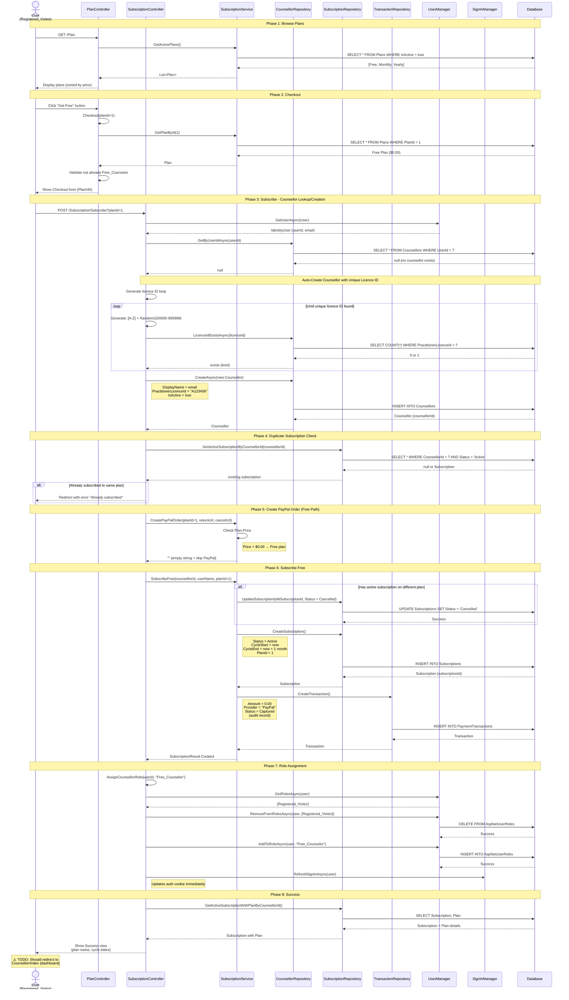
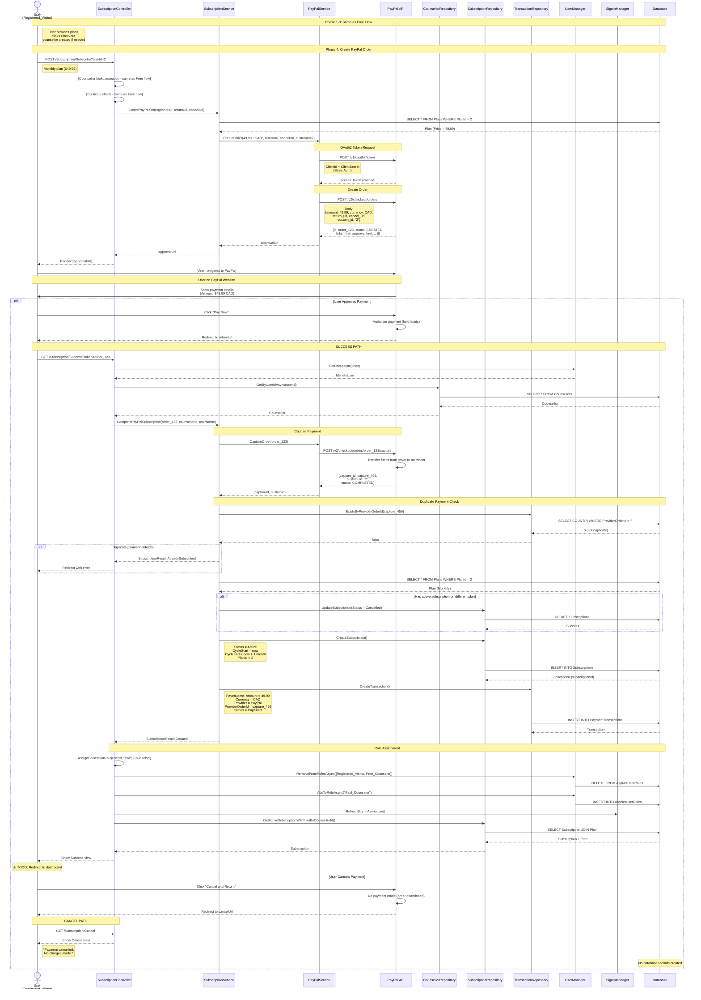
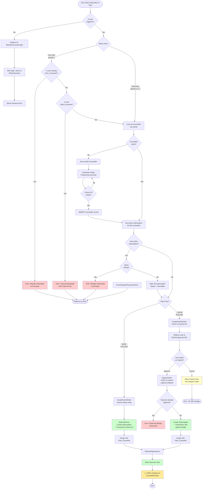

# Subscription Flow Diagrams

Complete visual documentation of the subscription flows in TeamYellow.

---

## Diagram 1: Free Subscription Flow (Detailed)

This diagram shows the complete flow when a user subscribes to the Free plan, including the automatic Counsellor profile creation logic.

**Key Points:**
- Counsellor profile auto-created with unique licence ID (format: 1 letter + 6 digits)
- Zero-dollar transaction recorded for audit purposes
- Role changes from `Registered_Visitor` → `Free_Counselor`
- Auth cookie refreshed immediately (no re-login needed)

---

## Diagram 2: Paid Subscription Flow with PayPal (Success & Cancel Paths)

This diagram shows the complete PayPal integration including both success and cancel scenarios.

**Key Points:**
- **PayPal OAuth:** Access token cached for performance
- **PayPal Order Flow:** Create → Approve (user on PayPal) → Capture (funds transferred)
- **Duplicate Prevention:** `ProviderOrderId` (capture ID) checked before creating transaction
- **Cancel Path:** Clean exit, no database changes
- **Role Upgrade:** Can upgrade from `Free_Counselor` to `Paid_Counselor` (old subscription cancelled)

---

## Diagram 3: Subscription Decision Flow (Activity Diagram)

This diagram shows all the validation and decision points in the subscription process.

**Decision Points:**
1. **Authentication Gate:** Login required to proceed
2. **Role Validation:** 
   - Free_Counselor cannot re-subscribe to Free
   - Paid_Counselor cannot downgrade via checkout
3. **Counsellor Auto-Creation:** Generated if doesn't exist
4. **Duplicate Prevention:** 
   - Subscription: Cannot subscribe to same plan twice
   - Payment: Capture ID checked (prevents double-charge)
5. **Plan Type Routing:** Price determines PayPal vs direct activation
6. **PayPal User Decision:** Approve or Cancel

---

## Summary

These three diagrams provide complete visibility into:
- **Free flow:** Direct activation with role assignment
- **Paid flow:** PayPal integration with payment capture
- **Decision logic:** All validation and branching paths

All business rules from the code are visualized, making it easy to:
- Onboard new team members
- Identify edge cases
- Plan refactoring work
- Document for stakeholders

**Next:** We can create similar diagrams for Admin role management and Plan browsing flows.
