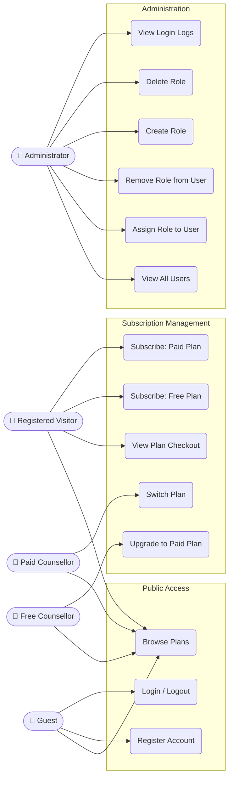
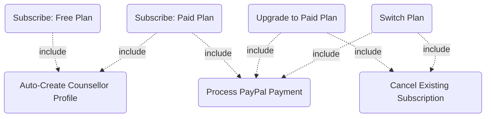
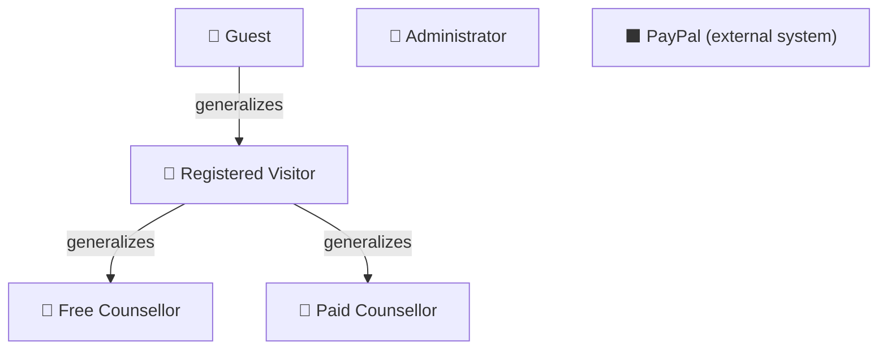

# Use Case Diagram: TeamYellow System

## Diagram 1 — Actor Use Case Map

## Diagram 2 — Include Relationships

## Diagram 3 — Actor Generalization

---

## Use Case Descriptions

### Public Access

| Use Case | Actor(s) | Description |
| -------- | -------- | ----------- |
| Browse Plans | Guest, all authenticated | View all active plans, prices, and features. Paid_Counselor sees current plan highlighted. |
| Register Account | Guest | Create a new account. User receives `Registered_Visitor` role. |
| Login / Logout | Guest (login), all authenticated (logout) | Authenticate using ASP.NET Identity. Session tracked in `UserLog` table. |

### Subscription Management

| Use Case | Actor(s) | Description |
| -------- | -------- | ----------- |
| View Plan Checkout | Registered_Visitor, Free_Counselor, Paid_Counselor | See plan details before confirming subscription. Validates eligibility (no duplicate/downgrade). |
| Subscribe to Free Plan | Registered_Visitor | Select Free plan. No payment required. include: Auto-Create Counsellor Profile. |
| Subscribe to Paid Plan | Registered_Visitor | Select Monthly or Yearly plan. include: Auto-Create Counsellor Profile + Process PayPal Payment. |
| Upgrade to Paid Plan | Free_Counselor | Upgrade from Free to Monthly/Yearly. include: Process PayPal Payment + Cancel Existing Subscription. |
| Switch Plan | Paid_Counselor | Switch between Monthly and Yearly. include: Process PayPal Payment + Cancel Existing Subscription. |
| Process PayPal Payment | System (triggered by above) | Create PayPal order, redirect to PayPal, capture payment, record transaction. |
| Auto-Create Counsellor Profile | System (triggered by subscribe) | If no Counsellor record exists for the user, generate a unique PractitionerLicenceId and create one. |
| Cancel Existing Subscription | System (triggered by upgrade/switch) | Mark the old active subscription as Cancelled before creating the new one. |

### Administration

| Use Case | Actor(s) | Description |
| -------- | -------- | ----------- |
| View All Users | Administrator | List all Identity users by email. |
| Assign Role to User | Administrator | Add a role to a selected user. |
| Remove Role from User | Administrator | Remove a role from a user. Cannot remove own Administrator role (business rule). |
| Create Role | Administrator | Add a new Identity role to the system. |
| Delete Role | Administrator | Delete a role. Blocked if users are currently assigned to it. |
| View Login Logs | Administrator | Audit log of all user login/logout sessions, including abandoned sessions. |
